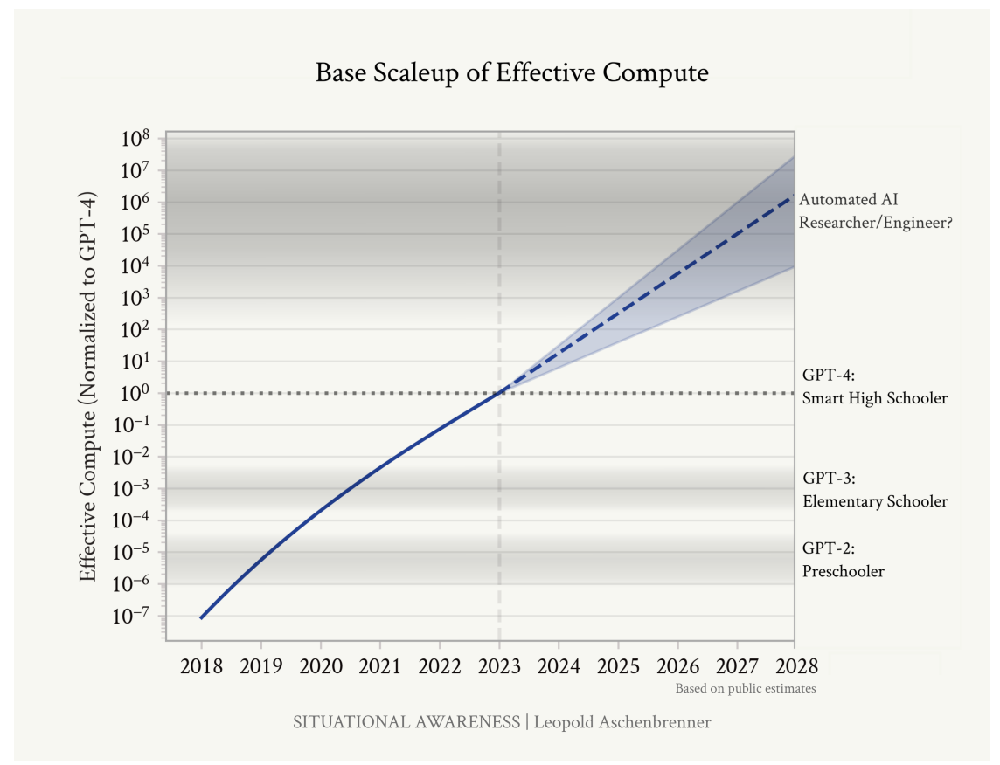

# Situational Awareness

What are the key arguments of the essay?

---

# Situational Awareness

Assumptions/Predictions:
-   LLM Scaling Laws will hold predictably and indefinitely
-   LLM token prediction improvement, of the type LLM scaling laws refers, lead to predictable increases in real world usefulness
-   Moore's Law + Data Center buildouts will continue growing exponentially in the near future

---
# Situational Awareness

Assumptions/Predictions:
-   LLM Scaling Laws will hold predictably and indefinitely
-   LLM token prediction improvement, of the type LLM scaling laws refers, lead to predictable increases in real world usefulness
-   Moore's Law + Data Center buildouts will continue growing exponentially in the near future

Conclusions:
-   By 2028, it will be clear that AI is the most powerful force in the world
-   It will inevitably be taken over by the "national security state"

---

# LLM Scaling Laws

---

# LLM Scaling Laws to Quality Improvement

---

# Moore's Law and Data Center Buildout

---

# The Singularity is Near

Ray Kurzweil, 2004:

---

# AI Alignment/AI and War/AI and National Security

---

