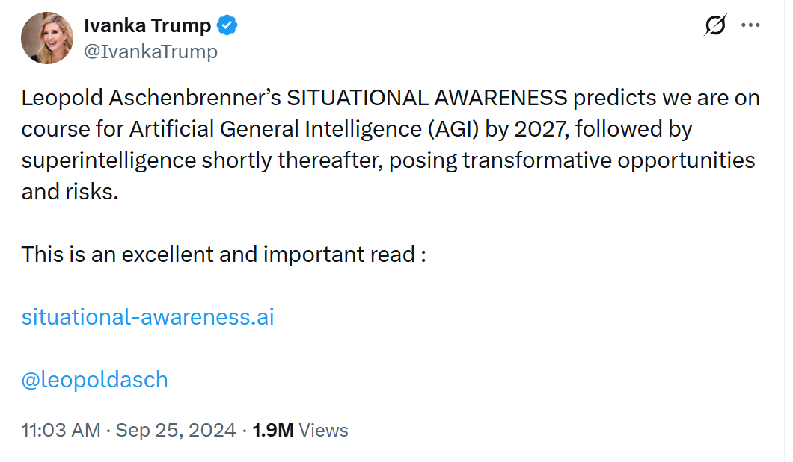
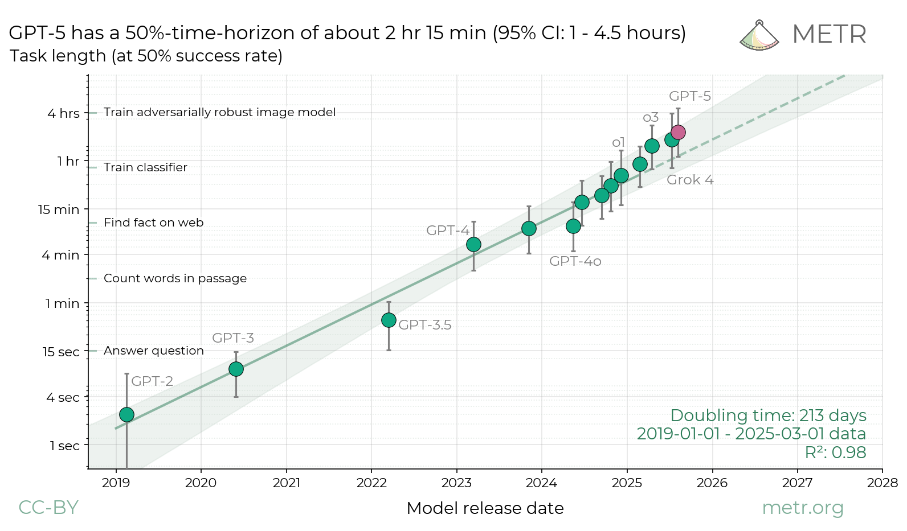
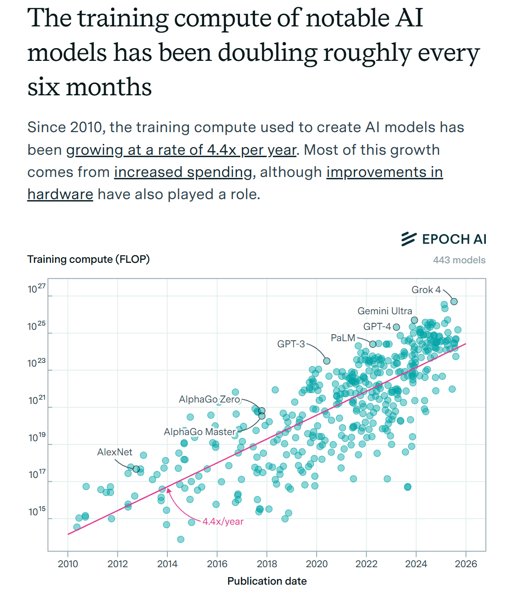
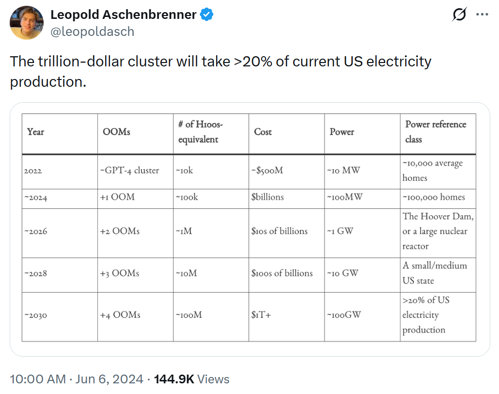
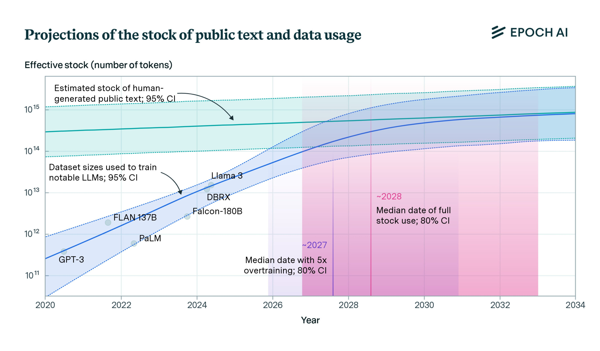

# Class 3

-   Discussion question and conversation
-   Lab time to organize + discuss final projects
-   Group discussion around final projects
-   Preview of next week's readings & discussion + some scheduling

---

# Situational Awareness

What are the key arguments of the essay?

---

---

# Situational Awareness

Assumptions/Predictions:
-   LLM Scaling Laws will hold predictably and indefinitely
-   LLM token prediction improvement, of the type LLM scaling laws refers, lead to predictable increases in real world usefulness
-   Moore's Law + Data Center buildouts will continue growing exponentially for at least the next 5 years
---
# Situational Awareness

<!-- _class: smalltext -->

Assumptions/Predictions:
-   LLM Scaling Laws will hold predictably and indefinitely
-   LLM token prediction improvement, of the type LLM scaling laws refers, lead to predictable increases in real world usefulness
-   Moore's Law + Data Center buildouts will continue growing exponentially

Conclusions:
-   By 2027/28, it will be clear that AI is the most powerful force in the world
-   It will inevitably be taken over by the "national security state"

---

# LLM Scaling Laws

Who can tell us what this is?

---

---

# LLM Scaling Laws to Quality Improvement

How much would you say LLMs have improved over the last few years?

Why?

---

---

Why might you believe the above figure? 

Why not?

Is there a way to answer this quantitatively?

---

---

# Moore's Law and Data Center Buildout

What's Moore's Law?
What does data center growth look like?
Will we run out of data?

---

---

# The Singularity is Near

Ray Kurzweil, 2004:

---

---

--- 

---

---

# AI Alignment/AI and War/AI and National Security

-   WSJ: Pentagon Used Anthropic’s Claude in Maduro Venezuela Raid:
    -    Use of the model through a contract with Palantir highlights growing role of AI in the Pentagon

-  Alignment easier or harder if nationalized?

-  Economic benefits larger or smaller if nationalized?

-  p(doom)?

---

# Lab time for final projects

---

# Semester logistics

-    Answer survey about movie night choices
-    Let us know about any upcoming absences due to upcomming religious or work comitments (e.g. Passover Seder April 2)

